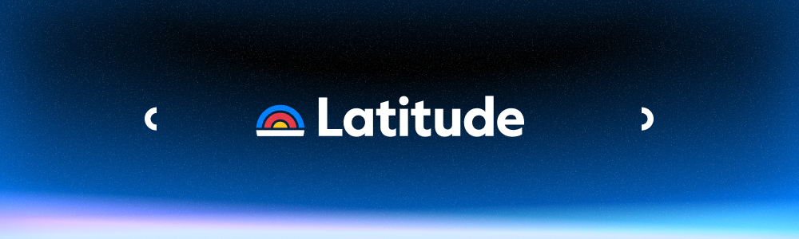

  Thanks to  

  

### [Open Source Agent Analytics](https://go.asgeirtj.workers.dev/latitude)  
[Understand your agents in production](https://go.asgeirtj.workers.dev/latitude)

---

# System Prompts Leaks

The full verbatim system prompts behind the most popular chatbots in the world. Carefully curated and complete. Feel free to open up a PR or get in contact if you got a different result.

      

**The Washington Post** built its interactive story on prompts from this repo: [See the hidden rules behind AI. Then use them to rewrite this article.](https://archive.today/pYtPk) (May 11, 2026)

**CEPS' AI World** built an interactive breakdown of what is inside system prompts, topic by topic, from this repo's files: [System prompts and what they tell us about the chat before the chat](https://aiworld.eu/story/system-prompts-and-what-they-tell-us-about-the-chat-before-the-chat) (July 10, 2026)

**Simon Willison** calls it "the most thorough leaked system prompt collection I know of": [ChatGPT search now uses the site: operator at scale](https://simonwillison.net/2026/Aug/20/chatgpt-search-now-uses-the-siteoperator-at-scale/) (August 20, 2026)

## Most recent additions/changes

| What | Date | Link |
|------|------|------|
| **Claude artifact types (Slides, Dashboard, Design, Docs)** | October 9, 2026 | [Slides](Anthropic/artifact-types/slides/SKILL.md) · [Dashboard](Anthropic/artifact-types/dashboard/SKILL.md) · [Design](Anthropic/artifact-types/design/SKILL.md) · [Design System](Anthropic/artifact-types/design-system/SKILL.md) · [Docs](Anthropic/artifact-types/docs/SKILL.md) · [all types](Anthropic/artifact-types/) |
| **Claude Haiku 5.5** | October 7, 2026 | [Claude Haiku 5.5 system prompt](Anthropic/claude-haiku-5.5.md) |
| **Haiku 5.5 Claude Code** | October 7, 2026 | [Claude Code system prompt (Haiku 5.5)](Anthropic/claude-code/claude-code-haiku-5.5.md) |
| **ChatGPT Dots** | October 5, 2026 | [Dreamer system prompt](OpenAI/dots/dreamer.md) · [Voice](OpenAI/dots/voice.md) · [all prompts](OpenAI/dots/) · [skills](OpenAI/dots/skills/) |
| **Muse Spark 1.3 Muse Code** | October 4, 2026 | [Muse Code system prompt (Muse Spark 1.3)](Meta/muse-code/muse-spark-1.3-muse-code.md) · [skills](Meta/muse-code/skills/) · [prompts](Meta/muse-code/prompts/) |
| **Meta Muse agent (VM files)** | October 3, 2026 | [Muse agent system prompt](Meta/muse-agent/workspace/system/system_prompt.md) · [all VM files](Meta/muse-agent/) |
| **Grok 4.7** | October 3, 2026 | [Grok 4.7 system prompt (grok.com)](xAI/grok-4.7.md) |
| **Fable 5.1 Claude Code on the web (cloud)** | September 30, 2026 | [Claude Code on the web system prompt (Fable 5.1)](Anthropic/claude-code/claude-code-cloud-fable-5.1.md) |
| **GPT-6.1-Sol Codex** | September 29, 2026 | [GPT-6.1-Sol Codex system prompt](OpenAI/Codex/gpt-6.1-sol.md) · [ChatGPT Work local](OpenAI/Codex/gpt-6.1-sol-chatgpt-work-local.md) |
| **Claude Sonnet 5.5** | September 29, 2026 | [Claude Sonnet 5.5 system prompt](Anthropic/claude-sonnet-5.5.md) |
| **Sonnet 5.5 Claude Code** | September 29, 2026 | [Claude Code system prompt (Sonnet 5.5)](Anthropic/claude-code/claude-code-sonnet-5.5.md) |
| **GPT-6-Sol Codex** | September 27, 2026 | [GPT-6-Sol Codex system prompt](OpenAI/Codex/gpt-6-sol.md) |

---
## Anthropic — Claude

### Claude.ai system prompts (web, desktop & mobile)

| Model | Prompt |
|-------|--------|
| **Claude Haiku 5.5** | [**Claude Haiku 5.5 system prompt**](Anthropic/claude-haiku-5.5.md) |
| **Claude Sonnet 5.5** | [**Claude Sonnet 5.5 system prompt**](Anthropic/claude-sonnet-5.5.md) |
| **Claude Opus 5.5** | [**Claude Opus 5.5 system prompt**](Anthropic/claude-opus-5.5.md) |
| **Claude Fable 5.1** | [**Claude Fable 5.1 system prompt**](Anthropic/claude-fable-5.1.md) |
| Claude Opus 5 | [Claude Opus 5 system prompt](Anthropic/claude-opus-5.md) |
| Claude Fable 5 | [Claude Fable 5 system prompt](Anthropic/claude-fable-5.md) |
| Claude Opus 4.8 | [Claude Opus 4.8 system prompt](Anthropic/claude-opus-4.8.md) |
| Claude Sonnet 5 | [Claude Sonnet 5 system prompt](Anthropic/claude-sonnet-5.md) |
| Claude Opus 4.7 | [Claude Opus 4.7 system prompt](Anthropic/claude-opus-4.7.md) |
| Claude Opus 4.6 | [Claude Opus 4.6 system prompt](Anthropic/claude-opus-4.6.md) · [No tools](Anthropic/claude-opus-4.6-no-tools.md) |
| Claude Sonnet 4.6 | [Claude Sonnet 4.6 system prompt](Anthropic/claude-sonnet-4.6.md) · [No tools](Anthropic/claude-sonnet-4.6-no-tools.md) |
| Injected reminders | [Claude.ai injected reminders](Anthropic/anthropic_reminders.md) |

### Claude Code system prompts

| Component | Prompt |
|-----------|--------|
| **Opus 5.5 Claude Code** | [**Claude Code system prompt (Opus 5.5)**](Anthropic/claude-code/claude-code-opus-5.5.md) |
| **Sonnet 5.5 Claude Code** | [**Claude Code system prompt (Sonnet 5.5)**](Anthropic/claude-code/claude-code-sonnet-5.5.md) |
| **Haiku 5.5 Claude Code** | [**Claude Code system prompt (Haiku 5.5)**](Anthropic/claude-code/claude-code-haiku-5.5.md) |
| **Fable 5.1 Claude Code** | [**Claude Code system prompt (Fable 5.1)**](Anthropic/claude-code/claude-code-fable-5.1.md) |
| **Fable 5.1 Claude Code Desktop** | [**Claude Code desktop app system prompt (Fable 5.1)**](Anthropic/claude-code/claude-code-desktop-fable-5.1.md) · [Fable 5](Anthropic/claude-code/claude-code-desktop-fable-5.md) |
| **Fable 5.1 Claude Code on the web** | [**Claude Code on the web (cloud) system prompt (Fable 5.1)**](Anthropic/claude-code/claude-code-cloud-fable-5.1.md) |
| **Fable 5.1 Claude Code headless** | [**Claude Code headless system prompt (Fable 5.1)**](Anthropic/claude-code/claude-code-headless-fable-5.1.md) |
| Opus 5 Claude Code | [Claude Code system prompt (Opus 5)](Anthropic/claude-code/claude-code-opus-5.md) |
| Fable 5 Claude Code | [Claude Code system prompt (Fable 5)](Anthropic/claude-code/claude-code-fable-5.md) |
| Opus 4.8 Claude Code | [Claude Code system prompt (Opus 4.8)](Anthropic/claude-code/claude-code-opus-4.8.md) |
| Sonnet 5 Claude Code | [Claude Code system prompt (Sonnet 5)](Anthropic/claude-code/claude-code-sonnet-5.md) |
| Claude Code (older models) | [Opus 4.7](Anthropic/claude-code/claude-code-opus-4.7.md) · [Opus 4.6](Anthropic/claude-code/claude-code-opus-4.6.md) · [Sonnet 4.6](Anthropic/claude-code/claude-code-sonnet-4.6.md) · [Haiku 4.5](Anthropic/claude-code/claude-code-haiku-4.5.md) |
| Subagents | [Claude Code subagent system prompts](Anthropic/claude-code/agents) |
| Advisor tool | [Advisor tool prompts (both sides)](Anthropic/claude-code/prompts/advisor-tool.md) |
| Skills & commands | [Claude Code skills](Anthropic/claude-code/skills) · [Slash commands](Anthropic/claude-code/commands) |
| Docs assistant | [docs.claude.com assistant instructions](Anthropic/claude-code/claude-code-docs-assistant.md) |

### Claude artifact types (Slides, Dashboard, Design, Docs)

| Type | Prompt |
|------|--------|
| Claude Slides | [Slides type skill](Anthropic/artifact-types/slides/SKILL.md) · [references](Anthropic/artifact-types/slides/artifact-type/reference) |
| Claude Dashboards | [Dashboard type skill](Anthropic/artifact-types/dashboard/SKILL.md) · [references](Anthropic/artifact-types/dashboard/artifact-type/reference) |
| Claude Design (canvas) | [Design type skill](Anthropic/artifact-types/design/SKILL.md) · [references](Anthropic/artifact-types/design/artifact-type/reference) |
| Claude Docs | [Docs type skill](Anthropic/artifact-types/docs/SKILL.md) |
| Design System | [Design System type skill](Anthropic/artifact-types/design-system/SKILL.md) · [references](Anthropic/artifact-types/design-system/artifact-type/reference) |

### Claude integrations

| Product | Prompt |
|---------|--------|
| **Claude Projects** | [**Claude Projects - Thread Claude system prompt**](Anthropic/claude-projects-thread-claude.md) |
| **Claude Design** | [**Claude Design system prompt**](Anthropic/claude-design/claude-design.md) · [skills](Anthropic/claude-design/skills) · [starter components](Anthropic/claude-design/starter-components) |
| **Claude Cowork** | [**Claude Cowork system prompt**](Anthropic/claude-cowork/claude-cowork.md) · [Dispatch](Anthropic/claude-cowork/claude-cowork-dispatch.md) · [setup skills](Anthropic/claude-cowork) |
| **Claude Science** | [**Claude Science system prompt**](Anthropic/claude-science.md) |
| Claude for Microsoft 365 | [Claude for Excel](Anthropic/claude-for-excel.md) · [Claude for Word](Anthropic/claude-for-word.md) · [Claude in PowerPoint](Anthropic/claude-in-powerpoint.md) |
| Claude in Chrome | [Claude in Chrome extension system prompt](Anthropic/claude-in-chrome.md) |
| Claude iOS app | [Claude mobile iOS system prompt](Anthropic/claude-mobile-ios.md) |

## OpenAI — ChatGPT

| Model | Prompt |
|-------|--------|
| ChatGPT 5.6 Sol | [ChatGPT 5.6 system prompt (Sol, extra high)](OpenAI/gpt-5.6-sol.md) |
| ChatGPT 5.5 Thinking | [ChatGPT 5.5 Thinking system prompt](OpenAI/gpt-5.5-thinking.md) |
| ChatGPT 5.5 Instant | [ChatGPT 5.5 Instant system prompt](OpenAI/gpt-5.5-instant.md) |
| ChatGPT 5.4 | [ChatGPT 5.4 Thinking system prompt](OpenAI/gpt-5.4-thinking.md) |
| ChatGPT 5.3 | [ChatGPT 5.3 Instant system prompt](OpenAI/gpt-5.3-instant.md) |
| ChatGPT 5.2 | [ChatGPT 5.2 Thinking system prompt](OpenAI/gpt-5.2-thinking.md) |
| ChatGPT 5 | [ChatGPT 5 Thinking system prompt](OpenAI/gpt-5-thinking.md) · [Agent mode](OpenAI/chatgpt-gpt-5-agent-mode.md) |
| ChatGPT Atlas | [ChatGPT Atlas system prompt](OpenAI/chatgpt-atlas.md) |
| ChatGPT 4.5 | [ChatGPT 4.5 system prompt](OpenAI/chatgpt-4.5.md) |
| ChatGPT 4o | [ChatGPT 4o system prompt](OpenAI/gpt-4o.md) · [Deprecation preparedness](OpenAI/chatgpt-4o-deprecation-preparedness-prompt.md) |
| Voice modes | [ChatGPT advanced voice mode system prompt](OpenAI/gpt-4o-advanced-voice-mode.md) · [Legacy voice mode](OpenAI/gpt-4o-legacy-voice-mode.md) |
| **ChatGPT Dots** | [**Dreamer system prompt**](OpenAI/dots/dreamer.md) · [Voice](OpenAI/dots/voice.md) · [Tools](OpenAI/dots/tools.md) · [Available skills](OpenAI/dots/available-skills.md) · [28 skills](OpenAI/dots/skills/) |
| Personalities | [ChatGPT personality instructions](OpenAI/chatgpt-personality-instructions.md) |
| Memory | [ChatGPT advanced memory system prompt](OpenAI/tool-advanced-memory.md) |

### Codex system prompts

| Model | Prompt |
|-------|--------|
| **GPT-6.1 Codex** | [**GPT-6.1-Sol Codex system prompt**](OpenAI/Codex/gpt-6.1-sol.md) · [ChatGPT Work local](OpenAI/Codex/gpt-6.1-sol-chatgpt-work-local.md) |
| **GPT-6 Codex** | [**GPT-6-Astra Codex system prompt**](OpenAI/Codex/gpt-6-astra.md) · [Sol](OpenAI/Codex/gpt-6-sol.md) · [Luna](OpenAI/Codex/gpt-6-luna.md) · [ChatGPT Work local](OpenAI/Codex/gpt-6-astra-chatgpt-work-local.md) |
| GPT-5.6 Codex | [Codex GPT-5.6 system prompt (Terra/Luna)](OpenAI/Codex/gpt-5.6.md) |
| GPT-5.5 Codex | [Codex GPT-5.5 system prompt](OpenAI/Codex/gpt-5.5.md) · [Full prompt](OpenAI/Codex/codex-full.md) · [Friendly](OpenAI/Codex/personality_friendly_gpt-5.5.md) · [Pragmatic](OpenAI/Codex/personality_pragmatic_gpt-5.5.md) |
| GPT-5.4 Codex | [Codex GPT-5.4 system prompt](OpenAI/Codex/gpt-5.4.md) · [Mini](OpenAI/Codex/gpt-5.4-mini.md) |
| Codex Spark | [Codex Spark system prompt](OpenAI/Codex/gpt-5.3-codex-spark.md) |
| Codex modes | [Plan mode](OpenAI/Codex/plan_mode.md) · [Auto-review](OpenAI/Codex/codex-auto-review.md) · [Computer use](OpenAI/Codex/computer-use.md) · [Control Chrome](OpenAI/Codex/control-chrome.md) · [In-app browser](OpenAI/Codex/control-in-app-browser.md) |
| Personas | [Friendly](OpenAI/Codex/personality_friendly.md) · [Pragmatic](OpenAI/Codex/personality_pragmatic.md) |

### API-injected prompts

| Model | Prompt |
|-------|--------|
| GPT-5.5 | [GPT-5.5 API system prompt](OpenAI/gpt-5.5-api.md) · [Pro](OpenAI/gpt-5.5-pro-api.md) |
| GPT-5.4 / 5.3 | [GPT-5.4 API](OpenAI/gpt-5.4-api.md) · [5.3 Chat](OpenAI/gpt-5.3-chat-api.md) · [5.3 Codex](OpenAI/gpt-5.3-codex-api.md) |
| o-series & older | [o3 / o4-mini reasoning-effort variants](OpenAI/API/) |

Old models, tools & deprecated features

| Category | Prompts |
|----------|---------|
| Old models | [GPT-4.5](OpenAI/gpt-4.5.md) · [GPT-4.1](OpenAI/gpt-4.1.md) · [GPT-4.1 Mini](OpenAI/gpt-4.1-mini.md) · [o3](OpenAI/Old/o3.md) · [o4-mini](OpenAI/Old/o4-mini.md) · [GPT-5.2 Mini (free)](OpenAI/gpt-5.2-mini-free-account.md) · [ChatGPT 4o Mini](OpenAI/Old/chatgpt-4o-mini.md) |
| Old 4o variants | [4o WhatsApp](OpenAI/Old/gpt-4o-whatsapp.md) · [4o new personality](OpenAI/4o-2025-09-03-new-personality.md) · [Monday GPT](OpenAI/Old/monday-gpt.md) |
| Old tools | [Canvas](OpenAI/Old/tool-canvas-canmore.md) · [Image gen](OpenAI/Old/tool-create-image-image_gen.md) · [File search](OpenAI/Old/tool-file_search.md) · [Python](OpenAI/Old/tool-python-code.md) · [Web search](OpenAI/Old/tool-web-search.md) |
| Old policies | [Image safety](OpenAI/Old/prompt-image-safety-policies.md) · [Image safety (2026)](OpenAI/Old/image-safety-policies.md) · [Automation context](OpenAI/Old/prompt-automation-context.md) |
| GPT-5 personalities | [Listener](OpenAI/gpt-5-listener-personality.md) · [Nerdy](OpenAI/gpt-5-nerdy-personality.md) · [Robot](OpenAI/gpt-5-robot-personality.md) |
| GPT-5.1 personalities | [Efficient](OpenAI/gpt-5.1-efficient.md) · [Professional](OpenAI/gpt-5.1-professional.md) · [Nerdy](OpenAI/gpt-5.1-nerdy.md) |
| Deprecated features | [Deep research tool](OpenAI/tool-deep-research.md) · [Study and learn](OpenAI/Old/study-and-learn.md) · [All](OpenAI/Old/) |

## Google — Gemini

| Model | Prompt |
|-------|--------|
| **Gemini 3.8 Flash** | [**Gemini 3.8 Flash system prompt**](Google/gemini-3.8-flash.md) |
| **Gemini 3.1 Pro** | [**Gemini 3.1 Pro system prompt**](Google/gemini-3.1-pro.md) · [API](Google/gemini-3.1-pro-api.md) |
| **Antigravity CLI** | [**Antigravity CLI system prompt**](Google/antigravity-cli.md) |
| Gemini 3.7 Flash | [Gemini 3.7 Flash system prompt](Google/gemini-3.7-flash.md) |
| Gemini 3.5 Flash | [Gemini 3.5 Flash system prompt](Google/gemini-3.5-flash.md) · [AI Studio](Google/gemini-3.5-flash-ai-studio.md) |
| Nano / Banana 2 | [Nano Banana 2 system prompt](Google/nano-banana-2-api.md) |
| Google Search AI Mode | [Google Search AI Mode system prompt](Google/google-search-ai-mode.md) |
| Gemini CLI | [Gemini CLI system prompt](Google/gemini-cli.md) |
| NotebookLM | [NotebookLM chat system prompt](Google/notebooklm-chat.md) |
| Jules | [Jules system prompt](Google/jules.md) |
| AI Studio Build | [AI Studio Build system prompt](Google/ai-studio-build.md) |
| Gemini 3 | [Gemini 3 Flash system prompt](Google/gemini-3-flash.md) · [Gemini 3 Pro](Google/gemini-3-pro.md) |
| Gemini YouTube | [Gemini YouTube system prompt](Google/gemini-youtube.md) |
| Gemini Diffusion | [Gemini Diffusion system prompt](Google/gemini-diffusion.md) |
| Gemini in Chrome | [Gemini in Chrome system prompt](Google/gemini-in-chrome.md) |
| Gemini Workspace | [Gemini Workspace system prompt](Google/gemini-workspace.md) |

Older models & variants

| Model | Prompt |
|-------|--------|
| Gemini 2.5 Pro | [API](Google/gemini-2.5-pro-api.md) · [Webapp](Google/gemini-2.5-pro-webapp.md) · [Guided learning](Google/gemini-2.5-pro-guided-learning.md) |
| Gemini 2.5 Flash | [Image preview](Google/gemini-2.5-flash-image-preview.md) |
| Gemini 2.0 Flash | [Webapp](Google/gemini-2.0-flash-webapp.md) |

## SpaceXAI — Grok

| Model | Prompt |
|-------|--------|
| **Grok 4.7** | [**Grok 4.7 system prompt** (grok.com)](xAI/grok-4.7.md) · [Grok CLI](xAI/grok-4.7-cli.md) |
| Grok 4.6 | [Grok 4.6 system prompt](xAI/grok-4.6.md) |
| Grok 4.5 | [Grok 4.5 system prompt](xAI/grok-4.5.md) |
| Grok Build | [Grok Build system prompt (CLI agent)](xAI/grok-build.md) |
| Grok 4.3 Beta | [Grok 4.3 Beta system prompt](xAI/grok-4.3-beta.md) |
| Grok 4.2 | [Grok 4.2 system prompt](xAI/grok-4.2.md) |
| Grok Expert | [Grok Expert system prompt](xAI/grok-expert.md) |
| Grok Bot | [Grok Bot system prompt](xAI/grok-bot.md) |

Older versions

| Model | Prompt |
|-------|--------|
| Grok 4.1 Beta | [Grok 4.1 Beta system prompt](xAI/grok-4.1-beta.md) |
| Grok 4 | [Grok 4 system prompt](xAI/grok-4.md) · [API](xAI/grok-api.md) |
| Grok 3 | [Grok 3 system prompt](xAI/grok-3.md) |
| Grok Account | [Grok account system prompt](xAI/grok-account.md) |
| Grok Personas | [Grok persona prompts](xAI/grok-personas.md) |
| Safety Instructions | [Grok safety instructions](xAI/grok-4-with-new-safety-instructions.md) |

## Meta — Muse

| Product | Prompt |
|---------|--------|
| **Muse agent** | [**Muse agent system prompt** (Muse Spark 1.3, VM)](Meta/muse-agent/workspace/system/system_prompt.md) · [home dir, docs, templates](Meta/muse-agent/) · [89 skills](Meta/muse-agent/skills/) |
| **Muse Code** | [**Muse Code system prompt** (Muse Spark 1.3)](Meta/muse-code/muse-spark-1.3-muse-code.md) · [skills](Meta/muse-code/skills/) · [prompts](Meta/muse-code/prompts/) |
| Meta AI (meta.ai) | [Muse Spark 1.1 system prompt](Meta/muse-spark-1.1-web.md) · [Muse Spark](Meta/muse-spark-1.0-web.md) |

## Perplexity

| Model | Prompt |
|-------|--------|
| **Perplexity** | [**Perplexity AI system prompt**](Perplexity/perplexity-ai.md) |
| **Perplexity Computer** | [**Perplexity Computer system prompt**](Perplexity/perplexity-computer.md) |
| **Deep Research** | [**Perplexity Deep Research system prompt**](Perplexity/deep-research.md) |
| Comet Browser | [Comet browser assistant system prompt](Perplexity/comet-browser-assistant.md) |
| Voice Assistant | [Perplexity voice assistant system prompt](Perplexity/voice-assistant.md) |

## Cursor

| Product | Prompt |
|---------|--------|
| Cursor | [Cursor system prompt](Cursor/cursor.md) |

## Mistral

| Product | Prompt |
|---------|--------|
| Mistral Medium 3.5 (Vibe) | [Mistral Medium 3.5 system prompt](Mistral/mistral-medium-3.5.md) |
| Mistral Code | [Mistral Code system prompt](Mistral/mistral-code.md) |

## Moonshot — Kimi

| Model | Prompt |
|-------|--------|
| **Kimi K3** | [**Kimi K3 system prompt**](Kimi/kimi-3.md) |
| Kimi K2.6 | [Kimi K2.6 system prompt](Kimi/kimi-2.6.md) |

## DeepSeek

| Product | Prompt |
|---------|--------|
| DeepSeek | [DeepSeek system prompt](DeepSeek/deepseek-chat.md) (chat.deepseek.com) |

## Z.ai — GLM

| Product | Prompt |
|---------|--------|
| GLM | [GLM serves no system prompt — verified & documented](GLM/README.md) |

## Notion AI

| Product | Prompt |
|---------|--------|
| Notion AI | [Notion AI system prompt](Notion/notion-ai.md) |

## Qwen

| Product | Prompt |
|---------|--------|
| **Qwen 3.8 Max** | [**Qwen 3.8 Max system prompt**](Qwen/qwen3.8-max.md) |
| Qwen 3.6 Plus | [Qwen 3.6 Plus system prompt](Qwen/qwen3.6-plus.md) |

## Microsoft — Copilot

| Product | Prompt |
|---------|--------|
| GitHub Copilot | [GitHub Copilot system prompt](Microsoft/github-copilot.md) |
| VS Code Copilot Agent | [VS Code Copilot agent system prompt](Microsoft/vscode-copilot-agent.md) |
| Copilot CLI | [Copilot CLI system prompt](Microsoft/copilot-cli.md) |
| Copilot for macOS (app) | [Copilot for macOS system prompt](Microsoft/copilot-macos-app.md) |
| Copilot in Word | [Copilot in Word system prompt](Microsoft/copilot-in-microsoft-word.md) |

## Other products

| Product | Prompt |
|---------|--------|
| Amp Code (Sourcegraph) | [Amp Code system prompt](Misc/amp-code.md) |
| CommandCode CLI | [CommandCode CLI system prompt](Misc/commandcode-cli.md) |
| Devin CLI | [Devin CLI system prompt](Misc/devin-cli.md) |
| Docker Gordon AI | [Docker Gordon AI system prompt](Misc/docker-gordon-ai.md) |
| ElevenLabs Voice Agent | [ElevenLabs voice agent system prompt](Misc/elevenlabs-voice-agent.md) |
| Reddit Answers | [Reddit Answers system prompt](Misc/reddit-answers.md) |
| Warp 2.0 Agent | [Warp 2.0 agent system prompt](Misc/warp-2.0-agent.md) |
| Zed AI | [Zed AI system prompt](Misc/zed.md) |

More products

| Product | Prompt |
|---------|--------|
| Brave Search | [Brave Search system prompt](Misc/brave-search.md) |
| Character AI | [Character AI system prompt](Misc/character-ai.md) |
| Confer | [Confer system prompt](Misc/confer.md) |
| Fellou Browser | [Fellou browser system prompt](Misc/fellou-browser.md) |
| Gizmo AI | [Gizmo AI system prompt](Misc/gizmo-ai.md) |
| Hermes | [Hermes system prompt](Misc/hermes.md) |
| Indus AI | [Indus AI system prompt](Misc/indus-ai.md) |
| Kagi Assistant | [Kagi assistant system prompt](Misc/kagi-assistant.md) |
| MiniMax M2.5 | [MiniMax M2.5 system prompt](Misc/minimax-m2.5.md) |
| Pi (Inflection) | [Pi system prompt](Pi/instructions.md) |
| Proton Lumo AI | [Proton Lumo AI system prompt](Misc/proton-lumo-ai.md) |
| Raycast AI | [Raycast AI system prompt](Misc/raycast-ai.md) |
| Sesame AI Maya | [Sesame AI Maya system prompt](Misc/sesame-ai-maya.md) |
| Stack Overflow AI Assist | [Stack Overflow AI Assist system prompt](Misc/stack-overflow-ai-assist.md) |
| t3.chat | [t3.chat system prompt](Misc/t3.chat.md) |
| t3 Code | [t3 Code system prompt](Misc/t3-code.md) |

---

## Star History

<a href="https://www.star-history.com/?repos=asgeirtj%2Fsystem_prompts_leaks&type=date&legend=top-left">
 <picture>
   <source media="(prefers-color-scheme: dark)" srcset="https://api.star-history.com/chart?repos=asgeirtj/system_prompts_leaks&type=date&theme=dark&legend=top-left&sealed_token=nQoprDv11LAhUfdEhJQwh68tLNZVsRs7HpDDtfYrhzCCLL2xEmKvfetWg0LmQZuILQqB1usXnKXoNaVQ1lHeHeRiTglzkKGDFoTOfXSa-Su6voM7qA10z3h9nYoDWU-kcj_XDRZ62dn9Xjddd1P5qpcng_ts_-LXBQWL8QPHyKVwh-79xpUb7XahpXoV" />
   <source media="(prefers-color-scheme: light)" srcset="https://api.star-history.com/chart?repos=asgeirtj/system_prompts_leaks&type=date&legend=top-left&sealed_token=nQoprDv11LAhUfdEhJQwh68tLNZVsRs7HpDDtfYrhzCCLL2xEmKvfetWg0LmQZuILQqB1usXnKXoNaVQ1lHeHeRiTglzkKGDFoTOfXSa-Su6voM7qA10z3h9nYoDWU-kcj_XDRZ62dn9Xjddd1P5qpcng_ts_-LXBQWL8QPHyKVwh-79xpUb7XahpXoV" />
   
 </picture>
</a>

<a href="https://www.star-history.com/asgeirtj/system_prompts_leaks">
 <picture>
  <source media="(prefers-color-scheme: dark)" srcset="https://api.star-history.com/badge?repo=asgeirtj/system_prompts_leaks&theme=dark" />
  <source media="(prefers-color-scheme: light)" srcset="https://api.star-history.com/badge?repo=asgeirtj/system_prompts_leaks" />
  
 </picture>
</a>

